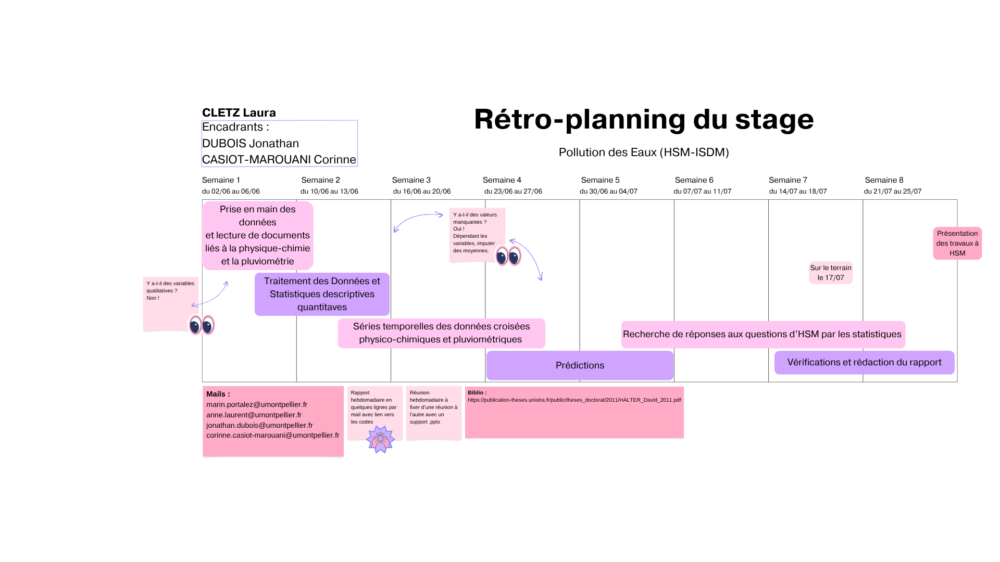

# Étude d'une base de données physico-chimiques et pluviométriques autour de l'ancienne mine de Carnoulès

Dans le cadre d'un stage de deux mois à l'ISDM (Institut de Science des Données de Montpellier) et à HSM (Hydrosciences Montpellier), 
ce projet consiste à explorer une base de données construite à partir des mesures de l'OREME, de l'ADEME et de Météo-France à travers 
des méthodes statistiques telles que les séries temporelles et les régressions multilinéaires afin de :
- Découvrir l'étendu de la pollution en métaux lourds et métalloïdes sur le site minier ;
- Comprendre le lien qu'il pourrait y avoir entre la pluie et les Drainages Miniers Acides (DMA) ;
- Observer l'influence du débit dans les nappes sur la concentration en métaux dans l'eau qui y coule.

Nous commencerons d'abord par mettre en ordre la base de données et imputer des valeurs moyennes ou médianes 
là où cela peut être nécessaire, il y a de nombreuses valeurs manquantes à traiter.

Nous réaliserons ensuite une courte série de statistiques descriptives que nous comparerons à des cas "normaux". Par exemple,
nous pourrions comparer la concentration moyenne en arsenic à chaque station au taux attendu dans une eau potable.

Nous pourrons enfin passer aux séries temporelles pour évaluer les tendances et saisonnalités, et y repérer les phénomènes irréguliers,
notamment ceux liés aux épisodes cévenoles qui se font de plus en plus fréquents. Ces résultats permettront, de plus, de créer des modèles de prédiction.
À peu près dans le même temps, nous testerons plusieurs modèles de régression de façon à expliquer les corrélations entre la pluie, le débit et les concentrations
en métaux. Ces modèles pourront aussi servir à la prédiction.

Stagiaire :
CLETZ Laura

Encadrants :
DUBOIS Jonathan, CASIOT-MAROUANI Corinne

---

# Study of a physico-chemical and rain database around the former Carnoulès mine

As part of a two-month internship at ISDM (Institut de Science des Données de Montpellier) and HSM (Hydrosciences Montpellier), 
this project involves exploring a database built from measurements by OREME, ADEME and Météo-France through 
statistical methods such as time series and multilinear regressions in order to:
- Discover the extent of heavy metals and metalloids pollution at the mining site;
- Understand the possible link between rain and Acid Mine Drainage (AMD);
- Observe the influence of groundwater flow on the concentration of metals in the water that flows through it.

We'll start by arranging the database and imputing mean or median values 
where necessary, as there are many missing values to process.

We will then produce a short sequence of descriptive statistics, which we will compare with "normal" cases. For example,
we could compare the average arsenic concentration at each station with the expected level in drinkable water.

Finally, we'll be able to move on to time series to assess trends and seasonality, and identify irregular phenomena, notably those 
linked to the increasingly frequent Cevennes episodes. Besides, these results will be used to create predictive models.
At roughly the same time, we will be testing several regression models to explain the correlations between rain, water flow and
metal concentrations. These models can also be used for prediction.

Trainee:
CLETZ Laura

Supervisors:
DUBOIS Jonathan, CASIOT-MAROUANI Corinne

---

  

